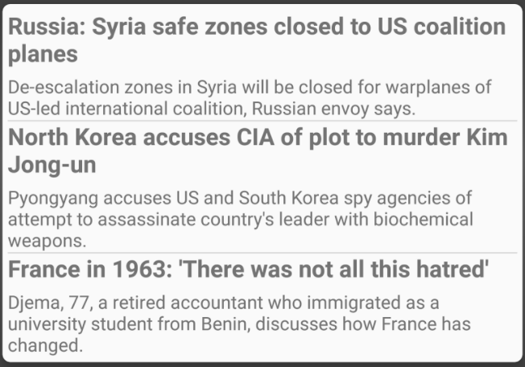

Project-3: TouchLab CardView App
=====
## By Dave, Justin, and Omar

For our third Unit Project, we were assigned to create a scrolling feed of different kinds of informative CardViews, a la Google Now. Here's what we came up with!

MTA Subway Status
-----

On startup, our app will fetch the current status of all the subway lines from the MTA servers and display it in a concise format. If there isn't enough room, for two columns of information, it will be displayed in one with less-cramped text. In addition, the card will show a distinct error state if the MTA servers could not be reached or had changed the format of their response.

News
-----

On startup, our app will fetch and display the top three news stories, currently hard-configured to come from Al-Jazeera News.

Calendar
-----

On startup, our app will fetch from any calendar on the phone and display the next three visible calendar events occuring during the coming 24 hours, formatting appropriately for all-day events and those extending beyond the current calendar day. Each event will have a button for sharing its contents to any application registered to receive a text string. In addition, the button will be colored to represent the signature color of the calendar from which the item came.

Weather
-----

Our most complex feature, we display weather in two separate ways. Weather is fetched from the OpenWeaterMap API upon startup, and periodically thereafter whenever the device says it has an internet connection. The card will display a distinct error state instead if the server could not be reached or returned an unintelligible response. If the user wishes to reset the weather locale until the app is restarted, they can click on the city name to display an alert dialog allowing them to enter a new search term with some basic entry qualification. In addition, each morning the app will fetch the weather and display a summary in a notification, whether or not the user has opened the app since reboot.

Additional Features
-----
- Our app will check for internet connection upon startup, and if there isn't it will display a notification card instead of trying to fetch any remote data.
- Our app will display the cards in a two-column staggered layout on wider screens, from landscape on a convention phone to portrait on a tablet.

**NOTE**.. in order to run the NETWORKFAILURE test you must put the device in airplane mode in order for it to pass. It tests if the app displays the proper card if / when the network is not connected. 
